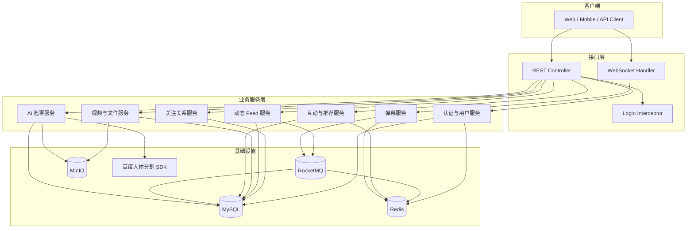
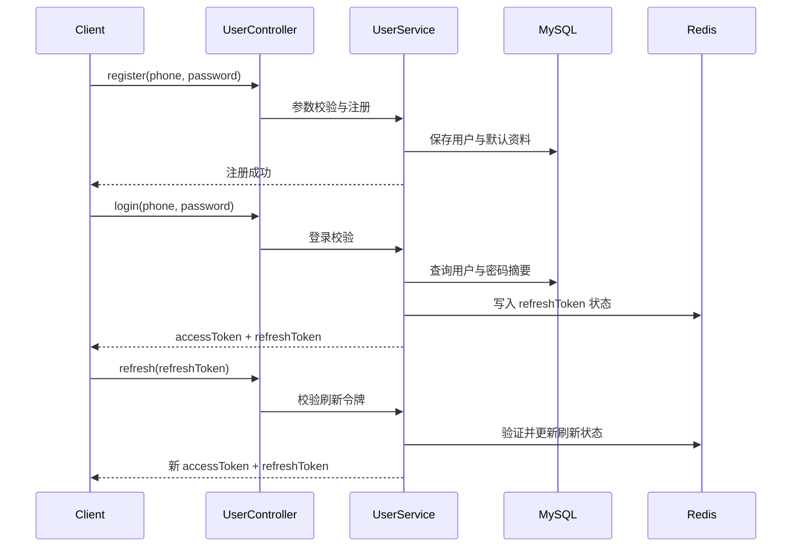
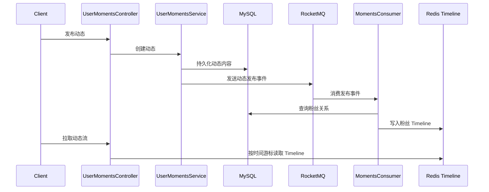
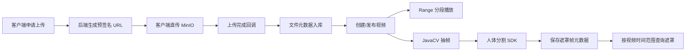
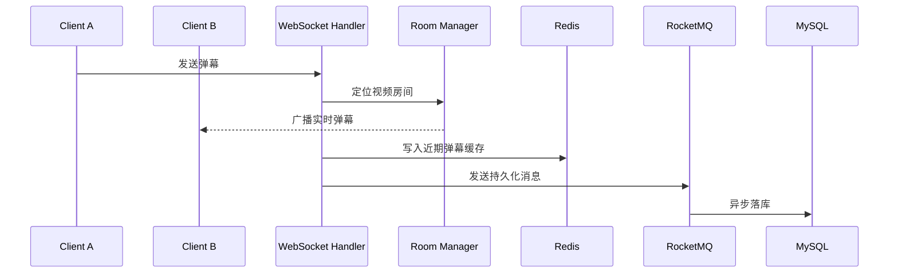

# 星芒 XingMang

> 基于 **Java / Spring Boot 3** 构建的微服务化视频社区后端系统，围绕“视频发布、社交关系、动态 Feed、实时弹幕、对象存储、异步消息、AI 视频遮罩”等核心链路进行工程化设计。

星芒不是一个简单的 CRUD 项目。项目将视频社区中常见的高频业务拆解为清晰的领域模块，并通过 **Redis、RocketMQ、MinIO、WebSocket、MyBatis-Plus、JWT 双 Token、JavaCV 与百度人体分割 SDK** 组合实现更接近真实业务的后端架构。

---

## 项目亮点

| 能力方向 | 实现方式 | 展示价值 |
| --- | --- | --- |
| 认证与会话 | BCrypt 密码加密、Access Token + Refresh Token、Redis 管理刷新令牌 | 体现登录安全、会话续期、登出失效等完整认证链路 |
| 社交关系 | 关注、粉丝、互关判断、关注分组 | 体现复杂列表组装、批量查询优化和领域建模能力 |
| 动态 Feed | MySQL 持久化 + RocketMQ 异步投递 + Redis Timeline | 体现异步解耦、读写分离思路和高频信息流设计 |
| 视频存储 | MinIO 对象存储、预签名 URL、文件元数据管理、分片上传 | 避免文件流压垮应用服务，贴近真实视频平台上传流程 |
| 视频播放 | HTTP Range 分段拉流 | 支持播放器拖动、续播和大文件分段读取 |
| 实时弹幕 | WebSocket 房间管理、Redis 近期弹幕缓存、RocketMQ 异步落库 | 体现实时通信、冷热数据分层和异步持久化设计 |
| 推荐与互动 | 点赞、收藏、投币、行为记录、个性化推荐入口 | 展示内容平台常见互动闭环 |
| AI 视频遮罩 | JavaCV 抽帧 + 百度人体分割 SDK + 遮罩帧元数据查询 | 在常规后端项目基础上增加 AI 多媒体处理能力 |
| 工程规范 | 分层架构、统一响应、统一异常、环境变量配置、测试文档 | 便于面试官快速理解项目边界与工程质量 |

---

## 技术栈

| 分类 | 技术 |
| --- | --- |
| 后端框架 | Java 21, Spring Boot 3, Spring MVC, Spring Security |
| 数据访问 | MyBatis-Plus, MySQL |
| 缓存与 Timeline | Redis |
| 消息队列 | RocketMQ |
| 对象存储 | MinIO |
| 实时通信 | WebSocket |
| 多媒体处理 | JavaCV |
| AI 能力 | 百度人体分割 SDK |
| 构建与测试 | Maven, JUnit 5 |

---

## 系统架构



---

## 与普通管理系统的区别

普通后台管理系统通常以“表单 + CRUD + 分页查询”为主，而星芒更强调 **内容平台型后端系统** 的工程复杂度：

1. **数据链路更长**：一次视频发布会涉及文件存储、元数据落库、状态流转、推荐/首页流展示。
2. **读写模型不同**：动态 Feed 使用 MySQL 记录源数据，通过 RocketMQ 异步写入 Redis Timeline，降低发布链路与读取链路之间的耦合。
3. **实时能力更强**：弹幕不是简单插库，而是 WebSocket 实时广播、Redis 近期缓存、MQ 异步持久化的组合链路。
4. **文件处理更接近生产环境**：视频文件通过 MinIO 管理，使用预签名 URL 和 Range 请求降低应用服务压力。
5. **包含 AI 多媒体能力**：通过 JavaCV 抽帧并调用人体分割 SDK，形成“视频文件 -> 抽帧 -> AI 分割 -> 遮罩帧查询”的处理流程。

---

## 核心业务流程

### 1. 登录与 Token 刷新



### 2. 动态 Feed 异步分发



### 3. 视频上传、播放与遮罩生成



### 4. 实时弹幕链路



---

## 目录结构

```text
src/main/java/com/example/xingmang
├── config          # 安全、拦截器、WebSocket、MinIO、RocketMQ、第三方 SDK 配置
├── controller      # REST API 接口层
├── exception       # 统一业务异常与全局异常处理
├── mapper          # MyBatis-Plus 数据访问接口
├── model           # DTO、Entity、VO、MQ Message 等模型对象
├── service         # 业务接口与实现
├── util            # JWT、Redis、RocketMQ、用户上下文等工具类
└── websocket       # 弹幕连接、房间与会话管理
```

---

## 快速启动

### 环境要求

- JDK 21+
- Maven 3.9+
- MySQL 8+
- Redis 6+
- RocketMQ 4/5 兼容服务
- MinIO

### 配置环境变量

项目不提交真实密钥。请复制示例文件，并在本地填入自己的配置：

```bash
cp .env.example .env
```

关键配置包括：数据库连接、Redis、RocketMQ、MinIO、JWT Secret、百度 AI SDK Key。生产环境建议使用环境变量、CI/CD Secret 或密钥管理服务注入。

### 启动项目

```bash
./mvnw spring-boot:run
```

Windows PowerShell：

```powershell
.\mvnw.cmd spring-boot:run
```

---

## 测试说明

```bash
./mvnw test
```

测试策略分为三类：

1. **单元测试**：验证纯业务逻辑与边界条件。
2. **轻量启动测试**：验证 Spring 上下文和基础 Bean 装配。
3. **接口场景测试**：`docs/http/*.http` 用于本地联调，不作为 CI 自动化测试直接执行。

详细说明见 [TESTING.md](./TESTING.md)。

---

## 接口调试文件

手动接口测试文件位于：

```text
docs/http/*.http
```

这些文件只保留占位 Token 与本地示例参数，不包含真实账号、真实密钥或真实访问令牌。执行前需要替换本地环境中的 `accessToken`、`videoId`、`fileId` 等参数。

---

## 开源安全说明

- 真实 `.env` 文件不应提交到 Git。
- 数据库密码、对象存储密钥、JWT Secret、第三方 API Key 必须通过环境变量注入。
- 如果历史提交中曾经出现过真实密钥，应立即轮换对应密钥。
- `target/`、IDE 配置、HTTP 响应缓存、日志文件等生成内容不应进入仓库。

---

## 面试展示建议

推荐从以下顺序介绍项目：

1. 项目不是后台管理系统，而是内容平台型后端，包含视频、社交、Feed、实时弹幕和 AI 处理链路。
2. 重点讲 Feed：MySQL 保存源数据，RocketMQ 异步分发，Redis Timeline 支持高频读取。
3. 重点讲弹幕：WebSocket 实时广播，Redis 做近期缓存，RocketMQ 异步落库。
4. 重点讲文件：MinIO 预签名 URL 与 Range 分段播放，降低应用服务压力。
5. 最后讲工程规范：统一异常、统一返回、环境变量配置、测试文档和开源安全处理。

---

## License

本项目采用 MIT License，详见 [LICENSE](./LICENSE)。
