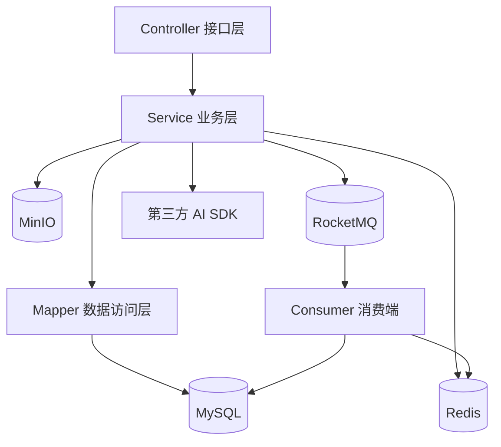

# 架构设计说明

本文档用于补充 README 中的系统介绍，重点说明项目的模块边界、关键链路和工程设计取舍。

## 1. 系统定位

XingMang 是一个基于 Java / Spring Boot 3 的视频社区后端系统。项目围绕内容平台的核心能力展开：

- 用户认证与会话管理
- 关注、粉丝、互关与分组
- 动态 Feed 发布与分发
- 视频上传、发布、播放与互动
- WebSocket 实时弹幕
- Redis 缓存与时间线
- RocketMQ 异步消息
- MinIO 对象存储
- AI 视频遮罩生成

项目采用单仓库组织，但在设计上按业务域和基础设施进行模块化拆分，便于后续演进为多服务部署形态。

## 2. 分层架构

### Controller 层

负责接收请求、完成基础参数传递并返回统一响应。复杂业务判断不放在 Controller 中，避免接口层膨胀。

### Service 层

负责业务编排、事务边界和跨资源协调。例如发布动态时，需要先写入 MySQL，再通过 RocketMQ 触发后续分发。

### Mapper 层

通过 MyBatis-Plus 操作数据库，保持数据访问逻辑与业务逻辑分离。

### Infrastructure 层

Redis、RocketMQ、MinIO、WebSocket、百度 AI SDK 等都通过配置类或基础设施封装接入，避免业务代码直接散落底层连接细节。

## 3. 关键设计

### 3.1 认证与会话

- 密码使用 BCrypt 存储，不保存明文密码。
- Access Token 用于短期接口访问。
- Refresh Token 存入 Redis，支持刷新与登出失效。
- 登录态通过拦截器解析后写入 ThreadLocal 上下文，业务层不直接解析请求头。

### 3.2 动态 Feed

Feed 使用“源数据持久化 + 异步分发 + Redis Timeline”的方式实现：

1. 动态内容先写入 MySQL，保证源数据可靠。
2. 发布事件发送到 RocketMQ。
3. 消费者查询粉丝关系，将动态 ID 写入粉丝的 Redis Timeline。
4. 客户端读取动态流时优先从 Redis 时间线分页读取。

这种方式避免了每次读取都做复杂关联查询，也降低了发布接口与分发逻辑之间的耦合。

### 3.3 视频文件与播放

视频文件存放在 MinIO，应用服务只负责生成预签名 URL、维护元数据和处理播放控制。播放接口支持 HTTP Range 请求，便于播放器进行拖动、续播和分段加载。

### 3.4 实时弹幕

弹幕链路分为三个动作：

1. WebSocket 实时广播给同一视频房间内的在线用户。
2. Redis 保存近期弹幕，支持播放器初始化时快速加载。
3. RocketMQ 异步持久化，降低实时发送路径的阻塞风险。

### 3.5 AI 视频遮罩

AI 遮罩模块通过 JavaCV 对视频进行抽帧，再调用人体分割 SDK 生成遮罩结果。遮罩帧以独立元数据形式存储，客户端可以按视频时间范围查询，从而支持播放过程中的局部加载。

## 4. 异常与降级

- 可预期业务错误使用 `ConditionException` 抛出，并由全局异常处理器统一返回。
- 非核心异步链路通过日志记录和消息重试降低对主流程的影响。
- 第三方服务、对象存储、消息队列等基础设施异常应在生产环境中配合监控告警与重试机制处理。

## 5. 后续可扩展方向

- 将用户、视频、Feed、弹幕、推荐拆分为独立微服务。
- 引入网关、服务注册发现和统一鉴权。
- 增加基于 Testcontainers 的集成测试。
- 为 RocketMQ 消费者补充幂等键和死信处理策略。
- 引入 OpenAPI 文档和 CI/CD 检查流程。
